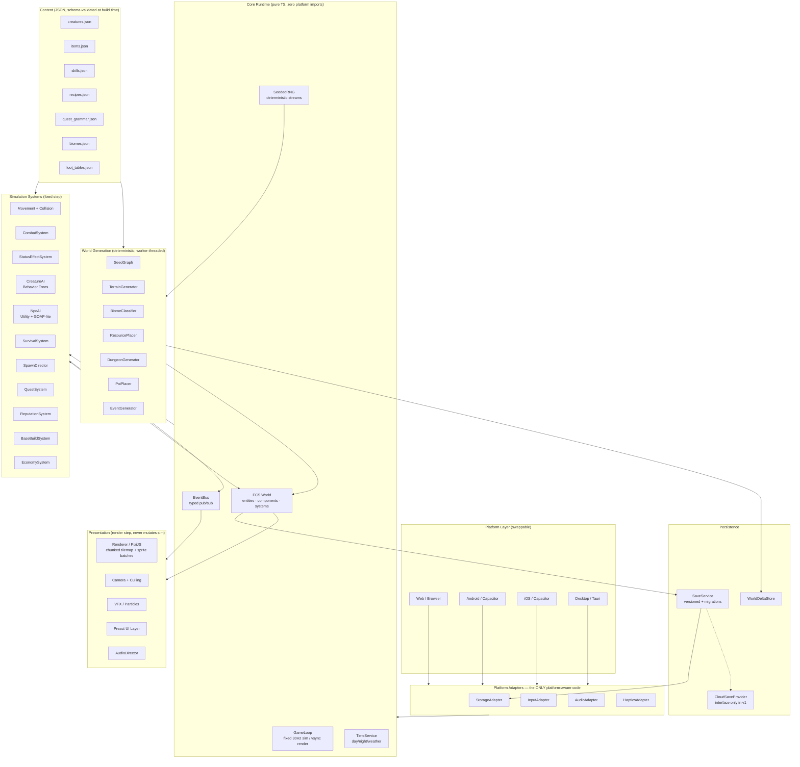

# Chronicles of the Lost Realm — Technical Design Document

**Version** 1.0 · **Date** 2026-08-28 · **Status** Awaiting approval before implementation

---

## 0. Stack Decision (approve this first — everything below depends on it)

| Concern | Choice | Why not the alternative |
|---|---|---|
| **Language** | TypeScript 5.x, strict, ES2022 | JS loses refactor safety on a 40k-line codebase |
| **Renderer** | **PixiJS v8** (WebGL2/WebGPU, batched sprites) | A custom renderer means writing a sprite batcher, texture atlas manager, and mask/filter pipeline — three months to reach parity with a library that already does it |
| **Engine** | **None** | Unity: 60–120 MB base APK, licence, C#, editor-centric workflow, painful web builds. Godot 4 web export is heavy and iOS export is friction. For a 2D tile game, an engine mostly adds ceremony |
| **Mobile shell** | **Capacitor 7** (single WebView, native plugins for FS/haptics/IAP) | React Native adds a bridge we don't need; Cordova is legacy |
| **Desktop (later)** | **Tauri 2** | Electron ships a 100 MB Chromium |
| **ECS** | Hand-rolled, ~180 LOC | bitECS/miniplex are fine, but our entity counts (≤3k live) don't need SoA archetypes. If profiling proves otherwise, bitECS is a drop-in behind the same façade |
| **State/UI** | **Preact + Signals** for HUD/menus, canvas for the world | React is 3× the bytes for identical output; a custom UI layer means re-solving layout and text input |
| **Build** | **Vite 6** | — |
| **Test** | **Vitest** + Playwright (web E2E) | — |
| **Persistence** | IndexedDB (web) / Capacitor Filesystem (native), behind one interface | — |
| **Math/noise/RNG** | Hand-rolled (~250 LOC total) | simplex-noise and seedrandom are ~40 lines each of real logic; we need determinism guarantees we control |

**Net:** ~6 runtime dependencies. Web build target **< 8 MB** initial (code + boot assets), assets streamed after.

> `ponytail:` no engine, no ECS library, no state-management library, no physics library. Added only when a profiler or a shipped bug says so.

---

## 1. Architecture Diagram



### 1.1 Hard Rules

1. **Core and Sim import nothing platform-specific.** Enforced by an ESLint `no-restricted-imports` boundary rule and a CI check. This is what makes 4 platforms cheap.
2. **Presentation reads the ECS; it never writes it.** Enforced by handing render systems a `ReadonlyWorld` type.
3. **All randomness goes through `SeededRNG` streams.** `Math.random` is banned by lint rule. Determinism is the foundation of the save system, the world graph, and every bug report.
4. **Content is data.** Adding a creature, item, skill, or recipe must never require a code change.

### 1.2 Module Layout

```
src/
  core/          loop, ecs, events, rng, time, math, log
  platform/      adapters + per-platform impls (web/, capacitor/, tauri/)
  sim/           systems/ (movement, combat, status, ai, survival, quest, ...)
  world/         gen/ (terrain, biome, resource, dungeon, poi, event), chunk, stream
  content/       *.json + zod schemas + build-time validator
  render/        renderer, tilemap, sprites, vfx, camera, atlas
  ui/            preact components, screens/, hud/, theme tokens
  persist/       save, migrations/, delta, cloud
  app/           bootstrap, scenes, config, feature flags
tests/           unit/, sim/, gen/, e2e/
tools/           atlas packer, content validator, balance sim, seed explorer
```

---

## 2. Entity System (ECS)

### 2.1 Why ECS here

Creatures, NPCs, players, projectiles, resource nodes, and buildings share ~70% of their behavior (position, health, status, AI). Inheritance produces a diamond within a week. ECS makes "a tamed creature is a creature that also has an Owner and a Bond" a one-line composition.

### 2.2 Implementation

```ts
// core/ecs/world.ts — ~180 LOC total
export type Entity = number;                    // index | (generation << 20)

export class World {
  private nextIndex = 1;
  private generations = new Uint16Array(MAX_ENTITIES);
  private free: number[] = [];
  private stores = new Map<ComponentId, ComponentStore<unknown>>();
  private queryCache = new Map<string, QueryResult>();  // invalidated on structural change

  create(): Entity;
  destroy(e: Entity): void;            // deferred to end of frame
  add<T>(e: Entity, c: ComponentType<T>, v: T): void;
  get<T>(e: Entity, c: ComponentType<T>): T | undefined;
  has(e: Entity, c: ComponentType<unknown>): boolean;
  remove(e: Entity, c: ComponentType<unknown>): void;
  query(...cs: ComponentType<unknown>[]): Iterable<Entity>;
}
```

- **Storage:** `Map<Entity, T>` per component for sparse data; `Float32Array` SoA for the three hot ones (`Position`, `Velocity`, `Health`) since those are iterated every tick over every entity.
- **Generational handles** prevent the classic use-after-destroy bug: a stale `Entity` fails `isAlive()` instead of hitting a recycled slot.
- **Deferred destruction** at frame end — systems never iterate a mutating set.
- **Query cache** keyed on the component signature, invalidated only on add/remove/destroy. Steady-state queries are zero-allocation.

> `ponytail:` Map-based sparse storage, SoA only for the 3 profiled-hot components. Ceiling: ~3k entities/tick. Upgrade path if we exceed it — archetype chunks or swap in bitECS behind this same façade.

### 2.3 Component Catalog (v1)

| Group | Components |
|---|---|
| **Spatial** | `Position`, `Velocity`, `Facing`, `Collider`, `ChunkRef` |
| **Vitals** | `Health`, `Stamina`, `Focus`, `Survival{hunger,warmth,sanity}` |
| **Combat** | `CombatStats`, `Threads`, `StatusEffects`, `Threat`, `SkillSet`, `Cooldowns`, `Hitbox`, `Invulnerable` |
| **Creature** | `CreatureId`, `Level`, `Experience`, `Bond`, `Nature`, `IVs`, `Trait`, `Owner`, `PartySlot`, `EvolutionState` |
| **AI** | `BehaviorTreeRef`, `Blackboard`, `Perception`, `Stance`, `Home`, `PatrolPath` |
| **NPC** | `NpcId`, `Faction`, `Relationship`, `Schedule`, `DialogueState`, `Inventory` |
| **World** | `Harvestable`, `Interactable`, `Structure`, `LootTableRef`, `Spawner`, `Persistent` |
| **Render** | `Sprite`, `Animation`, `LightSource`, `RenderLayer`, `Tint` |

### 2.4 System Execution Order (fixed 30 Hz tick)

```
1  InputIntent          → converts adapter input to intent components
2  AI (Creature, NPC)   → budgeted; see §6.4
3  Movement + Collision  → spatial-hash broadphase
4  Combat               → resolve hitboxes, apply damage
5  StatusEffect         → tick DoTs, expire
6  Survival             → hunger/warmth/sanity
7  Spawn Director       → density-driven spawns/despawns
8  Quest                → objective evaluation (event-driven, not polled)
9  Economy / Base       → production, restock (low frequency, 1 Hz)
10 Persistence          → record world deltas
11 Cleanup              → deferred destroys, event drain
```

Render runs on `requestAnimationFrame` with **interpolation alpha** between the last two sim states — so a 30 Hz sim renders as visually smooth 60 fps. This halves sim cost on mobile for free.

---

## 3. Save System

### 3.1 Requirements

Persist: player state, full creature roster, inventory, base layouts, quest state, faction rep, world deltas, discovered map, settings. Survive version upgrades. Never lose a 40-hour save. Work identically on 4 platforms.

### 3.2 Model

**The world itself is never saved — only the seed and the deltas.** A 2048×2048 Shard is 4.2M tiles; regenerating it from a seed takes ~180 ms in a worker. Storing it would be ~8 MB per Shard. So:

```ts
interface SaveGame {
  schemaVersion: number;          // migration key
  worldSeed: string;
  createdAt: number; playedMs: number;
  player: PlayerSave;             // attrs, meters, position, shardId, unlocks
  creatures: CreatureSave[];      // ~120 bytes each; 200 creatures = 24 KB
  inventory: ItemStack[];
  bases: BaseSave[];              // per-Shard structure lists
  quests: QuestSave;              // active + completed ids + procedural quest seeds
  factions: Record<FactionId, number>;
  world: Record<ShardId, ShardDelta>;
  discovery: Record<ShardId, Uint8Array>;  // fog-of-war bitmap, RLE-packed
  settings: Settings;             // separate slot too, so settings survive save deletion
}

interface ShardDelta {
  removed: number[];              // packed tile indices (harvested/destroyed)
  changed: Array<[index: number, tileId: number]>;
  entityDeltas: Array<{ spawnId: string; state: 'dead' | 'looted' | 'moved'; data?: unknown }>;
  poiState: Record<string, unknown>;   // dungeon cleared, chest opened, boss killed
}
```

**Measured target:** a 40-hour save ≈ 400–900 KB uncompressed, ~120–250 KB after gzip (`CompressionStream`, native in all targets — no library).

### 3.3 Write Strategy

- **Autosave** on: Riftgate use, base return, boss kill, quest completion, app background/pause. Plus every 3 minutes.
- **Atomic writes:** write to `save.N+1`, fsync/flush, then flip a pointer record. A crash mid-write costs at most one autosave interval, never the file.
- **Ring of 3 autosaves + 3 manual slots.** Corruption in one is never fatal.
- **Serialization off the main thread** (structured-clone the ECS snapshot to a worker) so a save never causes a frame hitch.
- **Integrity:** every blob carries a checksum. On load failure → try previous ring slot → report clearly, never silently start a new game.

### 3.4 Migrations

```ts
const migrations: Record<number, (s: any) => any> = {
  1: s => ({ ...s, factions: s.factions ?? DEFAULT_FACTIONS }),
  2: s => ({ ...s, creatures: s.creatures.map(addNatureField) }),
};
// load(): apply sequentially from s.schemaVersion to CURRENT_VERSION
```

Rule: migrations are **append-only and never deleted**, and every one ships with a fixture test loading a real save from the prior version. This is the cheapest insurance in the project.

### 3.5 Cloud Save (v1: interface + local impl only)

```ts
interface CloudSaveProvider {
  upload(slot: string, blob: Uint8Array, meta: SaveMeta): Promise<void>;
  download(slot: string): Promise<{ blob: Uint8Array; meta: SaveMeta } | null>;
  list(): Promise<SaveMeta[]>;
}
```

v1 ships `LocalOnlyProvider`. Conflict policy is decided now and written down so it doesn't get invented under pressure later: **compare `playedMs` + `lastWriteAt`, present both to the player, never auto-merge.** Adding Google Play Games / iCloud / a custom backend later is one class each.

> `ponytail:` one interface, two methods that matter, one implementation. No sync engine, no CRDTs, no server. Add when there is a second device to sync to.

---

## 4. Input & Platform Adapters

```ts
interface InputAdapter {
  poll(): InputState;   // { move: Vec2, aim: Vec2, buttons: bitmask, pointer: Pointer[] }
}
```

Three implementations: `TouchInput` (virtual stick + buttons + gestures), `KeyboardMouseInput`, `GamepadInput`. The sim only ever sees `InputState` — so control-scheme work never touches gameplay code, and gamepad support on mobile is free.

Touch specifics: floating stick with a 22 dp dead zone and a 64 dp radius; buttons are data-driven from a layout JSON the player can edit in-game; a 90 ms input buffer on attack/dodge so dropped taps under load don't feel like the game ignored you.

---

## 5. Combat System

### 5.1 Data-Driven Skills

```jsonc
{
  "id": "emberlance",
  "thread": "ember",
  "power": 62,
  "scaling": "MAG",
  "cooldownMs": 4200,
  "castMs": 350,
  "telegraphMs": 600,
  "shape": { "type": "line", "length": 6, "width": 1.5 },
  "onHit": [
    { "effect": "damage" },
    { "effect": "status", "status": "burn", "chance": 0.35, "stacks": 1 }
  ],
  "vfx": "ember_lance", "sfx": "fire_cast_02"
}
```

Every skill — player, creature, and boss — uses this one schema. Bosses add a `phases[]` array with HP thresholds and a script id. **Zero skill logic lives in code**; the `onHit` effect list is interpreted by a ~15-case switch. Adding a skill is a JSON edit.

### 5.2 Resolution Pipeline

```
SkillActivated
  → validate (cooldown, resource, range, silence/stun)
  → telegraph (spawn warning VFX, telegraphMs)
  → cast (lock, castMs, interruptible flag)
  → resolve shape → spatial-hash query → target list (capped, sorted by distance)
  → per target: hit check → damage formula (GDD §10.1) → mitigation
                → status roll → threat update → events
  → emit DamageDealt / EntityKilled / StatusApplied
```

Damage numbers, floating text, screen shake, and hit-stop are all **subscribers to events**, never inline in the combat code. This is why the sim can run headless in tests and in the balance simulator.

### 5.3 Hit Detection

Spatial hash, 4×4 tile cells. Broadphase by cell, narrowphase circle/AABB/cone. No physics engine — the game has no rigid bodies, no joints, no stacking. A physics library here would be 150 KB to do `distanceSquared < r*r`.

### 5.4 Status Effects

`StatusEffects` is a small array of `{ id, stacks, remainingMs, sourceEntity, tickAccumulator }`. One system ticks all of them. Stacking rules, caps, and immunity windows come from `statuses.json`. The chain-lock immunity from GDD §10.3 is a per-target `Map<statusId, immuneUntilMs>`.

### 5.5 Balance Simulator (tools/)

A headless harness that runs the real combat systems N=10,000 times across level/gear/party permutations and outputs TTK, win rate, and damage-share CSVs. Balance is measured, not guessed. Runs in CI on any change to `creatures.json`, `skills.json`, or the damage formula, and fails the build if a boss win rate leaves the 35–75% band at intended level.

---

## 6. Creature AI

### 6.1 Behavior Trees

Chosen over FSMs (which become spaghetti past ~6 states) and over GOAP (overkill for combat pets, and hard to debug on a phone).

```ts
type NodeResult = 'success' | 'failure' | 'running';
interface BTNode { tick(bb: Blackboard, dt: number): NodeResult; }
// Composites: Sequence, Selector, Parallel, RandomSelector
// Decorators: Inverter, Cooldown, Repeat, UntilFail, Succeeder
// Leaves: ~30 domain actions/conditions
```

Trees are authored in JSON and shared by archetype — 6 role trees (Tank/Bruiser/Assassin/Skirmisher/Mage/Support) plus per-creature overrides for trait-specific behavior. 40 creatures do **not** need 40 trees.

Example — Tank:
```
Selector
├─ Sequence [IsStanceHold]                        → HoldPosition
├─ Sequence [PlayerHpBelow(0.3), BondAtLeast(3)]  → InterposeBetween(player, threat)
├─ Sequence [AllyBeingFocused]                    → Taunt → EngageTarget
├─ Sequence [EnemyInRange]                        → SelectSkill → UseSkill → Reposition
└─ FollowOwner(distance: 3)
```

### 6.2 Blackboard

Per-entity: `target`, `lastKnownTargetPos`, `threatMap`, `homePos`, `ownerPos`, `perceivedAllies/Enemies`, `lastSkillTime`, `fleeThreshold`. Perception updates at 6 Hz, not every tick — vision cone + hearing radius, with line-of-sight raycast against the tile grid.

### 6.3 Bond-Modulated Behavior

Bond is not just a stat multiplier; it changes which branches are enabled. Bond ≥ 3 unlocks the "protect the player" branch, ≥ 5 unlocks skill-combo chaining with siblings, ≥ 7 unlocks self-preservation overrides (a high-bond creature will disengage to survive instead of obeying a suicidal order — and the player will feel that). This is the cheapest possible way to make "companionship" mechanically real.

### 6.4 Performance Budget

- **LOD:** full tick within 20 tiles of the camera; 4 Hz between 20–48; frozen beyond, with a coarse "simulate outcome" pass for wandering.
- **Time-slicing:** AI has a **2.5 ms per-tick budget**. Entities are round-robined across ticks; the budget is never exceeded, latency degrades gracefully instead.
- Behavior tree nodes are stateless and shared; only the blackboard is per-entity. 3,000 entities share 6 tree instances.

---

## 7. NPC AI

### 7.1 Utility-Based Daily Behavior

NPCs score a small action set each evaluation (every 2 s, offset per NPC):

```
score(action) = Σ (weight_i * curve_i(consideration_i))
```

Considerations: time of day, hunger, safety, work availability, player proximity, relationship. Actions: `Work`, `Eat`, `Sleep`, `Socialize`, `Trade`, `Flee`, `SeekPlayer`, `Patrol`. Full GOAP is not needed — NPCs don't plan multi-step chains, they pick the best next thing. Behaviour reads as intentional and costs ~0.1 ms per NPC per evaluation.

### 7.2 Reputation System

Two-layer, because they answer different questions:

```ts
interface Reputation {
  faction: Record<FactionId, number>;      // -100..100
  personal: Record<NpcId, {
    affinity: number;                      // -100..100
    trust: number;                         // 0..100, rises slowly, drops fast
    memory: MemoryEvent[];                 // capped ring of 20, decays
  }>;
}
```

- Faction rep changes propagate to member NPCs at **40% weight** — a Keeper doesn't personally hate you for a Keeper-wide slight, but they notice.
- `MemoryEvent` records `{ type, magnitude, timestamp, witnessed }`. **Witnessing matters:** an act only affects an NPC's personal rep if they saw it, heard about it (propagates through NPCs within 20 tiles at 60% magnitude), or it was public.
- Memory **decays** at `magnitude * 0.98^days`, floored — grudges fade but never fully vanish. This is what makes the world feel like it has a memory without an unbounded event log.
- Cross-faction: helping A costs B `0.4×` (GDD §3.3), and only if B would plausibly learn of it.

### 7.3 Dynamic Dialogue

```jsonc
{
  "id": "ossa_greet",
  "speaker": "elder_ossa",
  "conditions": { "act": [">=", 2], "trust": [">=", 40], "flag_not": ["ossa_betrayed"] },
  "priority": 60,
  "lines": [
    { "text": "You came back. The pattern holds a little longer.", "mood": "warm" }
  ],
  "responses": [
    { "text": "What do you need?", "goto": "ossa_tasks" },
    { "text": "[Lie] Nothing happened out there.",
      "check": { "attr": "Focus", "dc": 18 },
      "onPass": "ossa_believes", "onFail": "ossa_doubts", "repDelta": { "ossa": -8 } }
  ]
}
```

The engine picks the **highest-priority node whose conditions pass** — this is content-authorable, testable, and doesn't require a scripting language. Barks use the same condition system against a lightweight pool, with a per-NPC cooldown so no one repeats a line within 90 seconds.

### 7.4 Procedural Quest Generator

Implements the grammar in GDD §8.2:

```ts
function generateQuest(giver: Npc, ctx: WorldContext, rng: SeededRNG): Quest | null {
  const motive = pickWeighted(giver.motiveWeights, rng);
  const template = pickTemplate(motive, giver.faction, ctx.unlocks, rng);
  const objectives = template.objectives.map(o => bindObjective(o, ctx, rng)); // resolve concrete item/species/region
  if (!objectives.every(isReachable)) return null;                              // reject, caller re-rolls
  if (recentQuestCache.isDuplicate(objectives)) return null;
  return {
    id: `pq_${rng.streamId}_${ctx.tick}`,   // seed-derived: quests are reproducible from the save
    giver: giver.id, motive, objectives,
    reward: computeReward(objectives, ctx.playerLevel, ctx.rep[giver.faction]),
    twist: rollTwist(giver, ctx, rng),
  };
}
```

Generated quests store only their **seed and binding**, not their full text — so they cost ~60 bytes each in the save and regenerate identically on load.

### 7.5 Quest System (runtime)

Quests are **event-driven state machines**, never polled. Each objective subscribes to exactly the events it cares about (`ItemAcquired`, `EntityKilled`, `PoiCleared`, `CreatureTamed`, `LocationEntered`). A 60-quest journal costs near-zero per frame because nothing is scanning anything.

```
Quest: Inactive → Available → Active → (Completed | Failed | Abandoned)
Objective: Pending → Active → Complete   (with optional and hidden flags)
```

---

## 8. Procedural Generation Engine

### 8.1 Determinism Contract

```ts
class SeededRNG {              // xoshiro128** — fast, good distribution, 128-bit state
  constructor(seed: string | number);
  next(): number;              // [0,1)
  int(min: number, max: number): number;
  pick<T>(arr: T[]): T;
  weighted<T>(entries: Array<[T, number]>): T;
  fork(streamId: string): SeededRNG;   // hash(state, streamId) — independent substream
}
```

**Forked streams are the key discipline.** Terrain, resources, POIs, dungeons, loot, and quests each get their own stream. Adding a resource type therefore cannot shift the terrain of an existing save. Without this, every content patch corrupts every world.

### 8.2 Pipeline

```
worldSeed
  └─ shardSeed = hash(worldSeed, shardId)
       ├─ [terrain]   elevation, moisture, temperature fields    (worker)
       ├─ [biome]     Whittaker classify + edge blend + rivers   (worker)
       ├─ [structure] POI Poisson-disk placement, validate       (worker)
       ├─ [dungeon]   per-POI layout generation                  (lazy, on entry)
       ├─ [resource]  density-mapped node scatter                (per chunk, lazy)
       ├─ [spawn]     creature pool weighting                    (runtime)
       └─ [event]     event schedule for this shard              (runtime)
```

Everything through `[structure]` runs in a **Web Worker** on Shard entry; the rest is lazy per 64×64 chunk. Player sees a ~200 ms load, then nothing.

### 8.3 Terrain Generator

- **Noise:** hand-rolled OpenSimplex-style 2D gradient noise (~120 LOC) with fBm — 5 octaves elevation, 3 moisture, 2 temperature, each on its own stream.
- **Continent shaping:** radial falloff `elevation *= 1 - clamp(dist/radius)^2.2` gives islands with real coastlines, not noise mush.
- **Erosion:** one cheap thermal-erosion pass (8 iterations) to break up noise-looking ridgelines. Not hydraulic — 30× the cost for a detail nobody sees at this camera height.
- **Rivers:** pick N high-elevation sources, steepest-descent walk to sea, carve with a width that grows downstream. Rivers are the single highest-value/cost feature in terrain gen — they make a map read as a *place*.
- **Tile resolution:** 32 px, chunk = 64×64 tiles.

### 8.4 Biome Classifier

```ts
// Whittaker lookup, not a random pick — this is why the world reads as coherent
function classify(elev: number, moist: number, temp: number): BiomeId {
  if (elev < SEA_LEVEL)         return 'ocean';
  if (elev > MOUNTAIN)          return temp < 0.3 ? 'frostspire' : 'ashen_wastes';
  if (temp > 0.7 && moist < 0.3) return 'dust_sea';
  if (temp > 0.6 && moist > 0.7) return 'sunken_mire';
  if (temp < 0.25)              return 'frostspire';
  return 'verdant_reach';
}
```

Edges are dithered over a 4-tile band using a blue-noise mask, so borders interlock instead of forming a hard line or a muddy gradient.

### 8.5 Resource Placement

Per chunk, per resource type: `density = biomeBase * noiseMask(x,y) * clusterBonus`, then Poisson-disk sample so nodes never overlap and never form a grid. Rarity is enforced by a **budget per Shard**, not by low per-roll probability — that guarantees a rare material actually exists somewhere rather than statistically maybe existing. Placement is validated against walkability so nothing spawns unreachable.

### 8.6 Dungeon Generator

Three algorithms behind one interface (GDD §4.4):

- **Warren:** cellular automata (45% fill, 4 smoothing passes), flood-fill to keep the largest region, connect stragglers with tunnels.
- **Vault:** BSP partition → rooms → corridor spanning tree → add 15% extra edges for loops → **lock-and-key graph** placed by topological order so a key is never behind its own door.
- **Spiral:** concentric ring corridors + radial spokes, boss at center.

All three then run the **same post-pass:** place entrance/exit, guarantee connectivity (flood-fill assert), decorate from room templates, place encounters by a difficulty budget, place loot by depth, and run a **solvability validator**. Generation retries up to 5 times on validator failure, then falls back to a hand-authored layout. A player must never see an unbeatable dungeon.

### 8.7 Event Generator

Per Shard, a seeded schedule of the recurring events (GDD §13.1) plus a runtime **Director** that can inject events based on player state: too safe → raise Duskveil pressure; roster gaps → schedule a Migration of a species the player lacks; too poor → a Caravan with a good buy price. Bounded, transparent, and disable-able in options — dynamic difficulty that lies to the player is worse than none.

### 8.8 Chunk Streaming

Load radius 3 chunks (7×7 = 49 resident ≈ 200k tiles), unload at radius 5 with hysteresis to prevent thrash. Chunk generation is queued to the worker with a **1-chunk-per-frame apply budget** so a fast-moving player never causes a hitch. Tilemap render uses baked chunk meshes, rebuilt only on tile change.

---

## 9. Rendering & Performance

### 9.1 Frame Budget (60 fps = 16.6 ms), mid-tier Android target (Snapdragon 6-series, 2021)

| Stage | Budget |
|---|---|
| Sim (30 Hz, so amortized) | 4.0 ms |
| — of which AI | 2.5 ms (hard cap) |
| Culling + render prep | 2.0 ms |
| GPU submit / draw | 6.0 ms |
| UI (Preact, only on change) | 1.0 ms |
| Audio | 0.5 ms |
| Headroom | 3.1 ms |

### 9.2 Techniques

- **Texture atlases**, one per biome + one shared UI/character atlas → target **< 40 draw calls** per frame.
- **Chunked static tilemap meshes** — the ground costs ~4 draw calls regardless of map size.
- **Aggressive culling:** camera AABB + a 2-tile margin; off-screen entities skip animation and render entirely.
- **Object pooling** for projectiles, damage numbers, particles, and VFX. Zero allocation in the hot loop is the actual goal — GC pauses are the #1 cause of mobile jank in JS games.
- **Sprite instancing** via PixiJS ParticleContainer for anything > 200 identical sprites.
- **Sim/render decoupling** with interpolation (§2.4) — the single biggest win available.
- **Adaptive quality:** monitor a 60-frame rolling average; degrade in fixed steps (particle density → shadow quality → light count → render scale 1.0/0.85/0.75). Never degrade gameplay-critical clarity.
- **Memory:** hard budget **350 MB** on mobile. Texture atlases streamed per biome and evicted on Shard change; audio decoded on demand; save serialization in a worker.

### 9.3 Load Time Targets

| | Cold start | Shard transition | Save/Load |
|---|---|---|---|
| Web | < 4 s to menu | < 1.5 s | < 400 ms |
| Mobile | < 5 s to menu | < 2 s | < 600 ms |

Achieved via: code-split by scene, boot with a 2 MB critical bundle, stream biome assets on demand, generate terrain in a worker behind the transition animation.

---

## 10. Content Pipeline

- All content in JSON, validated against **Zod schemas at build time** — a typo in `creatures.json` fails the build, not the player's session.
- A generated `content.d.ts` gives compile-time IDs, so `skills.use('embrlance')` is a type error.
- `tools/atlas-pack` builds atlases + a sprite manifest from `assets/raw/`.
- `tools/balance-sim` (§5.5) and `tools/seed-explorer` (renders 200 seeds to PNG for eyeballing generation quality) run in CI.
- Content hot-reload in dev: edit `creatures.json`, see it live, no restart. This is where designer velocity actually comes from.

---

## 11. Testing Strategy (full plan in TestPlan.md)

| Layer | Tool | Scope | Gate |
|---|---|---|---|
| Unit | Vitest | Formulas, RNG, ECS, save migrations | 85% on `sim/`, `core/`, `persist/` |
| Determinism | Vitest | Same seed → identical world hash, ×1000 seeds | Must be exact |
| Simulation | Headless harness | 10k combat sims, TTK/win-rate bands | Boss win rate 35–75% |
| Migration | Fixture saves | Every prior schema version loads | Must pass, no exceptions |
| Generation | Property tests | Every dungeon solvable, every POI reachable, ×5000 seeds | Zero failures |
| E2E | Playwright | New game → tame → craft → base → boss → save/load | Green on main |
| Performance | Automated bench | Frame time on a fixed replay, 3 device profiles | p95 < 16.6 ms |
| Device | Manual matrix | 6 Android, 4 iOS, 4 browsers | Pre-release |

---

## 12. Live-Ops Seams (v1 builds the seams, not the features)

Four cheap architectural decisions now that make later features possible without a rewrite — and **nothing more than that**:

1. **Authoritative-sim shape.** Sim is deterministic, fixed-step, input-driven, and free of platform/render coupling. That is exactly the shape a server needs. Multiplayer later = run the same sim in Node, send inputs instead of state.
2. **Entity IDs are stable and namespaced** (`shard:spawnIndex`), so a networked entity mapping is a rename, not a redesign.
3. **`CloudSaveProvider` interface** (§3.5) — the same seam serves guild/trading storage.
4. **Content is signed JSON bundles** — the Event Seed format (GDD §13.2) is already the delivery mechanism for seasonal content, with no client patch.

> `ponytail:` no netcode, no server, no accounts, no rollback, no lobby, no ledger in v1. These four decisions cost roughly zero today and are the difference between "add multiplayer" and "rewrite the game." Everything else waits until there is a shipped game and a reason.

---

## 13. Risks

| Risk | Likelihood | Impact | Mitigation |
|---|---|---|---|
| **Scope** — this is a 5-system game | High | Critical | Vertical slice first (one biome, 8 creatures, one boss, full loop). Ship the slice before widening. |
| Mobile perf on low-end | Med | High | Perf gates in CI from week 1, on real devices. Not "optimize later." |
| Procgen produces boring maps | Med | High | `seed-explorer` in CI; hand-authored set pieces stitched in; rivers + POI density are the levers |
| Save corruption | Low | Critical | Ring buffer, atomic writes, checksums, migration fixture tests |
| iOS WebView perf (no JIT in WKWebView for some paths) | Med | High | Early spike on real hardware; PixiJS is the mitigation; fallback is reduced sim rate on iOS |
| Balance across 40 creatures × 8 bosses | High | Med | Automated balance sim as a CI gate, not a spreadsheet |
| Content volume (40 creatures × 8 dirs × animations) | High | Med | Silhouette-first design, shared skeletons, 4 drawn directions mirrored |

---

## 14. Proposed Build Order

| Milestone | Content | Exit criteria |
|---|---|---|
| **M0 — Skeleton** (2 wk) | Loop, ECS, renderer, input adapters, save stub | A square moves on a tile grid at 60 fps on a real phone |
| **M1 — World** (3 wk) | Terrain, biome, chunk streaming, resources | Walk a full generated Shard; same seed → same world, verified by test |
| **M2 — Vertical Slice** (5 wk) | Combat, 8 creatures, taming, inventory, crafting, 1 boss, HUD | 30 minutes of genuinely fun play, on a phone, in a browser |
| **M3 — Systems** (6 wk) | Full 40 creatures, base building, NPC AI, quests, economy | All five progression tracks live |
| **M4 — Content** (8 wk) | 7 biomes, 8 bosses, dungeons, main story | Playable start to finish |
| **M5 — Polish** (5 wk) | Perf, accessibility, audio, balance passes, device matrix | All CI gates green on all targets |

**Gate at M2.** If the vertical slice is not fun, no amount of M3–M5 fixes it.

---

*End of Technical Design Document v1.0*
