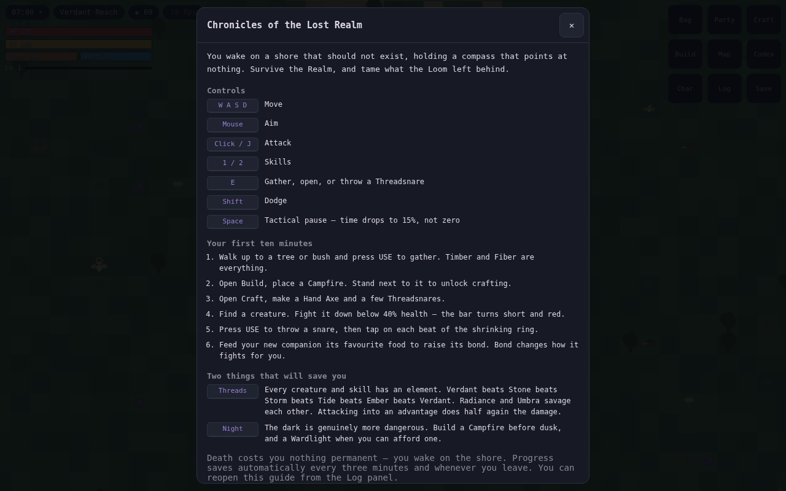
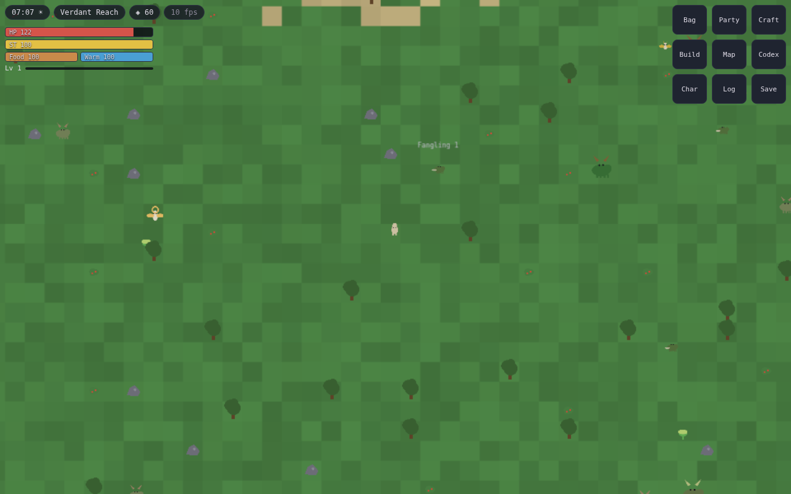
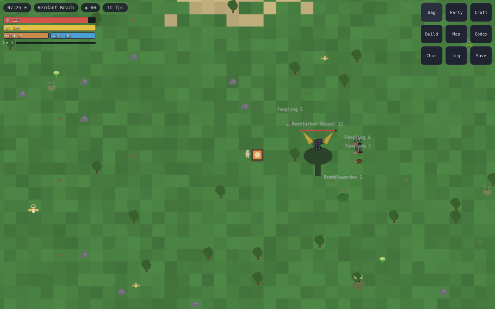
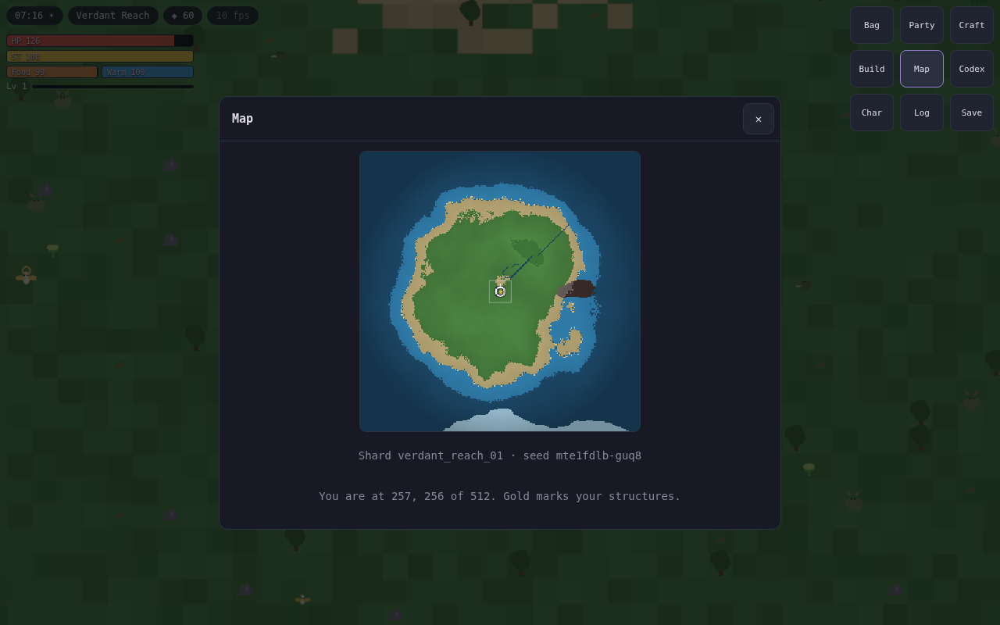
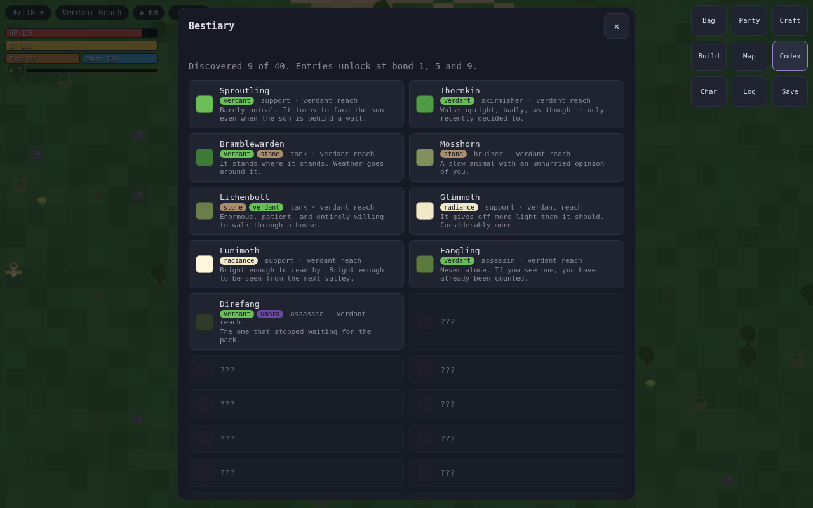
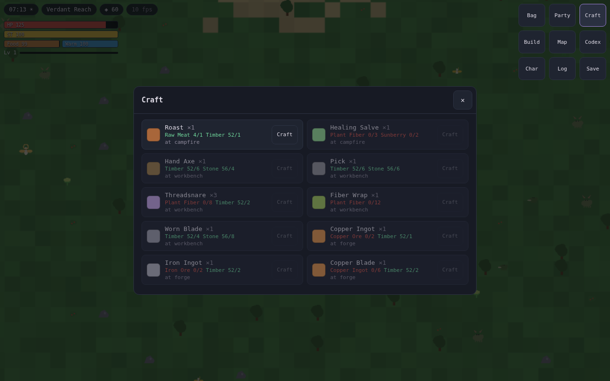
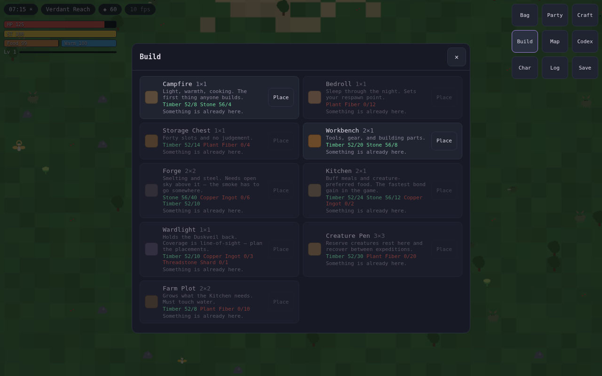
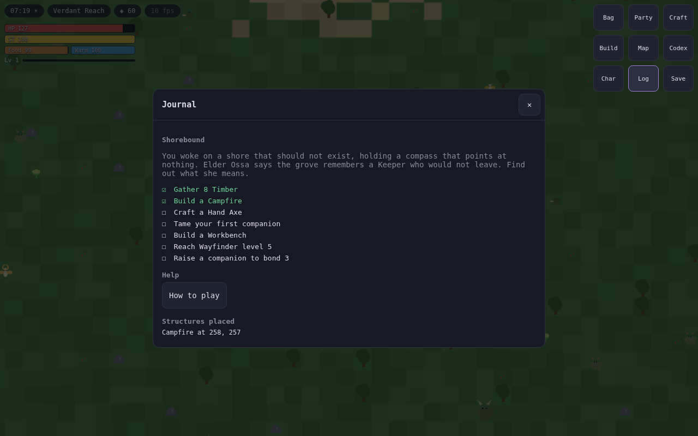
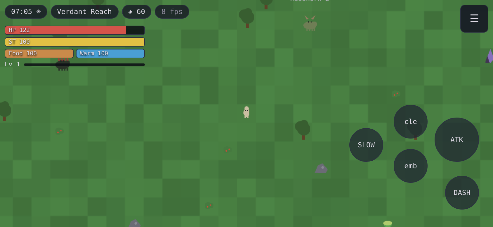
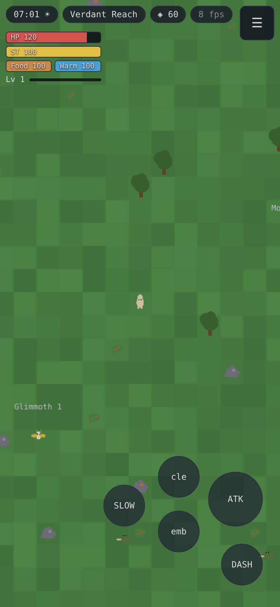

# UI/UX Mockups

These are not aspirational drawings — the layouts below are implemented and the
screenshots are captured from the running build by `tools/screenshots.mjs`.

---

## 1. Screenshots from the running build

Captured by `node tools/screenshots.mjs` against the production build.

| | |
|---|---|
|  | **First-run guide.** Controls, the first ten minutes, and the two rules that will save you. Reopenable from Log → How to play. |
|  | **Exploration, desktop.** Procedural Verdant Reach, streamed creatures, nameplates only within 9 tiles. |
|  | **Combat.** Floating damage numbers, telegraph shapes, status tint. |
|  | **Rootfather Ossuel.** Phase banner, boss health bar, summoned adds. |
|  | **Map.** The whole Shard, shaded by elevation, with coastline, ridge, player marker and viewport box. |
|  | **Bestiary.** 40 entries, three-stage lore unlocked by bond. |
|  | **Crafting.** Requirements coloured by whether you have them; station gating inline. |
|  | **Building.** Costs, placement rules, and why a placement is refused. |
|  | **Journal.** Act I objectives, evaluated live from world state. |
|  | **Mobile landscape.** Menu collapsed to one control; floating stick anchors at the left thumb; action cluster right. |
|  | **Mobile portrait.** Same markup, reflowed. |

## 2. HUD layout — landscape (primary)

```
┌────────────────────────────────────────────────────────────────────┐
│ ⟨07:14 ☀⟩ ⟨verdant reach⟩ ⟨◈ 60⟩ ⟨60 fps⟩                    ╭────╮│
│                                                              │ ☰  ││
│ ▓▓▓▓▓▓▓▓▓▓░░░ HP 125                                         ╰────╯│
│ ▓▓▓▓▓▓▓▓▓▓▓▓▓ ST 100                                               │
│ ▓▓▓▓▓▓▓ Food │ ▓▓▓▓▓▓▓▓ Warm      (the nine-button grid stays laid │
│ Lv 4 ▬▬▬▬▬▬░░░░░░░░░░░░            out above 620px wide / 480px tall)│
│                                                                    │
│                              ◈                                     │
│                          (player)                                  │
│                                                          ╭──────╮  │
│                                                          │ SLOW │  │
│      ╭─────────╮                                ╭─────╮  ╰──────╯  │
│     │     ●     │  floating stick               │ cle │            │
│     │           │  (appears at thumb)           ╰─────╯  ╭──────╮  │
│      ╰─────────╯                                ╭─────╮  │ ATK  │  │
│                                                 │ emb │  │      │  │
│ ┌────────┬────────┬────────┐   ╭─────╮          ╰─────╯  ╰──────╯  │
│ │Bristle │Mosshorn│ Stance │   │ USE │                   ╭──────╮  │
│ │Lv18 ♥4 │Lv12 ♥2 │        │   ╰─────╯                   │ DASH │  │
│ │▬▬▬▬▬▬░ │▬▬▬▬▬▬▬ │        │                             ╰──────╯  │
│ └────────┴────────┴────────┘                                       │
└────────────────────────────────────────────────────────────────────┘
```

### Rules enforced in code and asserted by the e2e suite

| Rule | Where |
|---|---|
| The menu collapses to one control on a phone, either axis | 9 permanent buttons covered a quarter of the screen |
| The toggle stands down while a panel is open | it shared the corner with the panel's close button, making X unclickable |
| Every interactive target ≥ 48 px, ≥ 8 px apart | `styles.css` `--tap`, asserted in `e2e/mobile.spec.ts` |
| Movement stick floats to the thumb, never fixed | `TouchInput.onDown` |
| Nothing interactive inside the safe-area insets | `env(safe-area-inset-*)` throughout |
| Left half = movement, right half = aim and actions | `TouchInput`, `TouchControls` |
| Buttons are DOM, not canvas hit-tests | `TouchControls.tsx` |
| Button labels are text, not dingbats | glyphs like U+2694 render as tofu on some Android font stacks |
| Camera stays centred on the player | asserted in `e2e/boot.spec.ts`, to ±24 px |

The **thumb-reach map** drove the action cluster placement: on a 6.1" phone held
in landscape, the right thumb sweeps a ~90 mm arc from the lower-right corner.
Primary attack sits at the centre of that arc; the two skills are one joint
further; the pause is furthest, because it is used least under pressure.

---

## 3. Panel anatomy

Every panel is the same shell — one component, eight bodies:

```
┌──────────────────────────────────────────┐
│  Craft                               ✕   │  ← 40px close, always same place
├──────────────────────────────────────────┤
│ ┌──┬──────────────────────────┬────────┐ │
│ │▣ │ Healing Salve ×1         │ [Craft]│ │  ← swatch · content · action
│ │  │ Fiber 3/3  Sunberry 0/2  │        │ │     requirements coloured by
│ │  │ at campfire              │        │ │     have (green) / lack (red)
│ └──┴──────────────────────────┴────────┘ │
│ ┌──┬──────────────────────────┬────────┐ │
│ │▣ │ Hand Axe ×1              │ [Craft]│ │
│ └──┴──────────────────────────┴────────┘ │
└──────────────────────────────────────────┘
```

Single column below 620 px, two columns above; the menu collapses below 620 px
wide *or* 480 px tall, which is what catches landscape phones. Two breakpoints
total. There is no separate mobile UI to maintain, which is the only reason a
two-platform UI stays shippable.

---

## 4. Taming minigame

The one moment the game takes over the screen. A ring shrinks toward a fixed
target; three beats; tap when they align.

```
              ╭ ─ ─ ─ ─ ─ ─ ─ ╮
            ╱                   ╲
          │      ╭ ─ ─ ─ ╮       │        outer ring shrinks over 3s
          │     ╱  target  ╲     │        tap when it crosses the target
          │    │     ◌      │    │
          │     ╲         ╱      │
          │      ╰ ─ ─ ─ ╯       │
            ╲                   ╱
              ╰ ─ ─ ─ ─ ─ ─ ─ ╯

                 ● ● ○                    beats landed
              Tap on the beat
```

Each landed beat adds +18% to the capture roll (`tameChance` in
`src/sim/formula.ts`). Missing every beat still leaves a real chance, and every
*failure* permanently raises your odds with that species — the mercy mechanic
that stops the 200th attempt from feeling like the first.

---

## 5. Information hierarchy

Ordered by how fast the player must read it:

1. **Instant, peripheral** — own health, danger telegraphs, damage numbers.
   Position and shape carry these; they must be readable without looking away
   from the player character.
2. **Glanceable, < 0.5 s** — party health, cooldowns, time of day, hunger.
   Top-left and bottom-left, out of the action.
3. **Deliberate** — inventory, crafting, bestiary. Behind a panel, game paused.

Nothing in tier 3 is ever needed under combat pressure. That is why panels
pause the simulation and the HUD does not.

---

## 6. Accessibility surface

| Feature | Status |
|---|---|
| Touch targets ≥ 48 px | done, asserted in CI |
| Safe-area insets | done |
| `prefers-reduced-motion` respected | done (`styles.css`) |
| `aria-label` on every icon-only control | done |
| `role="meter"` with values on vitals | done |
| Focus-visible outlines | done |
| Colourblind-safe encoding (shape + colour) | done in telegraphs and status glyphs |
| First-run guide, reopenable | done |
| Text scaling 80–200% | planned — the CSS is rem-ready, the toggle is not built |
| Remappable touch layout | planned — button positions are already data, not hard-coded geometry |
| Combat assists (damage reduction, auto-play) | planned, GDD §14 |

The first seven are in the build. The last three are honest "not yet" — they are
in the roadmap, not silently dropped.
